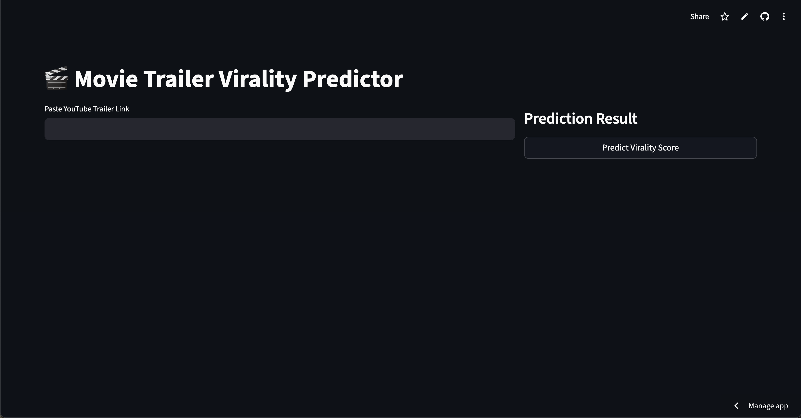
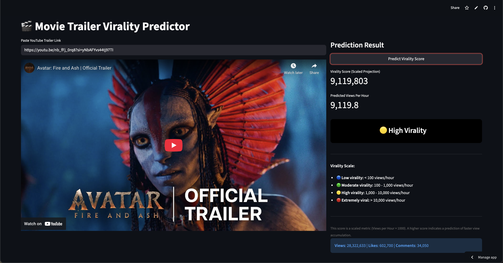

# Trailer Virality Predictor

A machine learning–driven web application that analyzes YouTube trailers and predicts their early-stage virality using real‑time metadata, view‑velocity metrics, and a custom virality scoring algorithm.

---

## 🚀 Project Overview

The **Trailer Virality Predictor** extracts key statistics from YouTube trailer links, processes engagement patterns, and generates a virality score that helps understand how well a trailer might perform shortly after release.

This project includes such as:

- Automated YouTube data collection
- Feature engineering based on view velocity
- Virality prediction logic
- Streamlit based interactive interface

---

## 🧠 Key Features

- **Real Time YouTube Data Fetching** – Automatically pulls video metadata such as views, likes, comments, publish time, and more using Youtube's API v3.
- **Virality Scoring Model** – Computes view‑velocity (views/hour) and applies a normalization strategy to predict whether a trailer is gaining traction. The model is built using xgBoost Regressor.
- **Interactive Streamlit App** – Allows users to input a trailer URL and view predictions, analytics, and engagement breakdown instantly.

---

## 📸 UI Previews

- **Home Screen**
  

- **Prediction Output**
  

---

## 📂 Project Structure

```
├── app.py                  # Streamlit app UI
├── main.py                 # Core application runner
├── data_collector.py       # YouTube metadata fetcher
├── virality_predictor.py   # Virality scoring logic
└── README.md
```

---

## 🔧 How It Works

1. User enters a **YouTube trailer URL**.
2. The system fetches metadata using a custom data collector.
3. Features such as **views/hour**, **like ratios**, and **engagement metrics** are generated.
4. Virality prediction logic determines whether a trailer is:

   - **Highly viral**,
   - **Moderately viral**, or
   - **Low traction**.

5. Results are displayed with supporting analytics and data tables.

---

## ▶️ Running the Project

### **1. Install Dependencies**

```bash
pip install -r requirements.txt
```

### **2. Run Streamlit App**

```bash
streamlit run app.py
```

---

## 🎬 Project can be also accessed On

```
https://trailerviralitypredictor-sakshiii27.streamlit.app/
```

---

## 📈 Future Enhancements

- Train a full ML model using historical trailer datasets
- Add sentiment analysis from YouTube comments
- Support for TikTok / Instagram Reel virality
- Comparison charts for multiple trailers

---

## 📝 Author

Built by **Sakshi Prasad Paygude**

---
